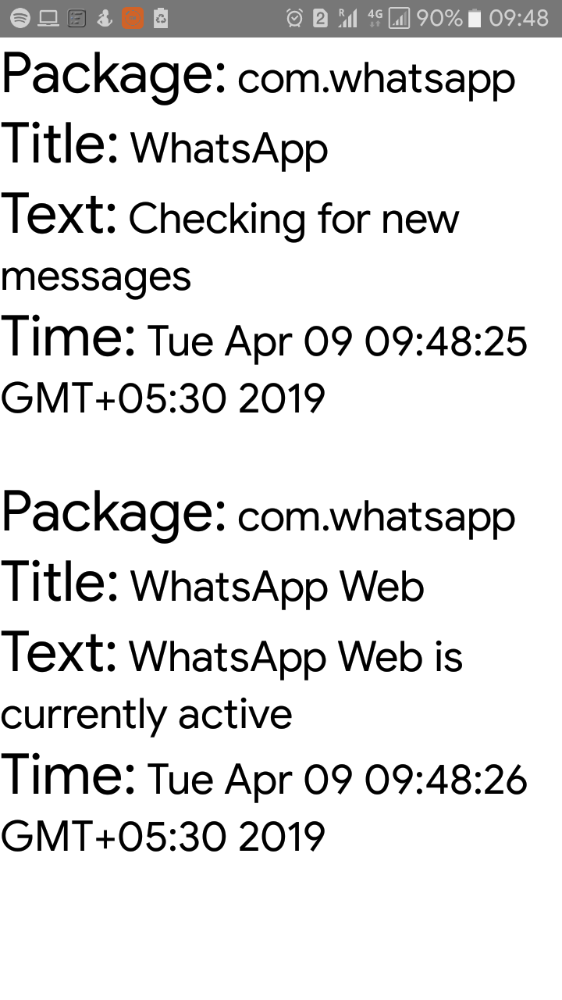

# ViaSight

ViaSight is an accessibility Android launcher meant for visually 
impaired individuals. Its purpose is to allow such individuals to use 
their smartphones in a similar way to others by employing 
_sensory substitution_. 

#### Installation instructions:
The app works on devices running Android Marshmallow (API Level 21) up 
to Android Q (API Level 28). The APK file can be found in [apk](apk/) 
folder. Simply copy the file onto a compatible Android device and 
install. 

#### Technical details:
Sensory substitution is done here by providing different vibration 
patterns. Each pattern holds a different purpose. It helps train the 
user to rely on haptic feedback during certain events. These events (in 
case of the app) are incoming notifications, positive TTS responses and 
negative TTS responses. 

It has support for swipe gestures:
* Swipe left to enable voice commands (as mentioned below)
* Swipe right once to read notifications
* Swipe right again to stop reading notifications

ViaSight currently supports voice commands like the following:
* **_open_** <app_name>
* **_what_** is the _date_/_time_/_battery percentage_?
* **_call_** <contact_name>
* **_remove_** _notifications_
* **_play_** _tutorial_
* **_set_** _volume_ _silent_/_vibrate_/_normal_

#### Permissions required:
* Vibrate
* Record Audio
* Call phone
* Read contacts

#### Screenshots:

    

